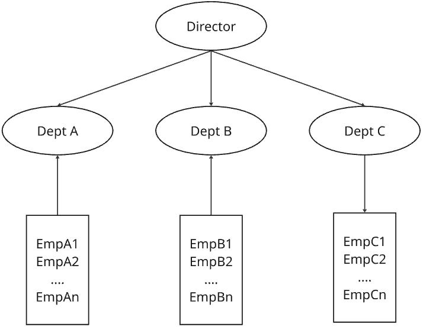
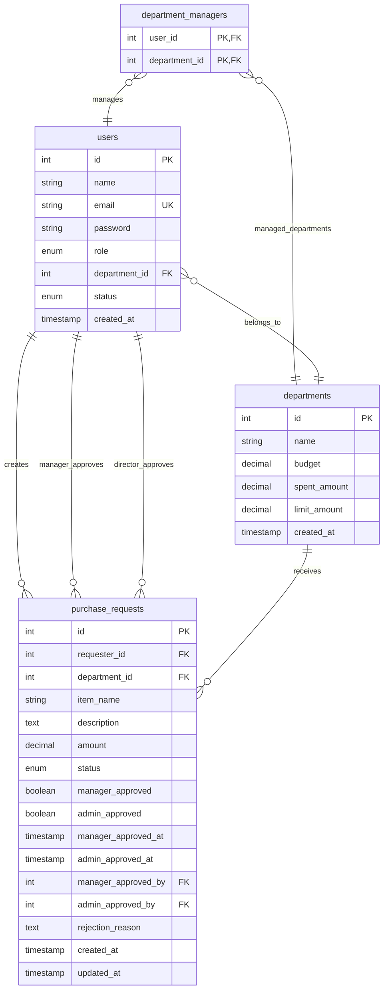

# Procurement-System

## Entity Relationship Diagram

## Tables

### users

**Purpose**: Stores user account information and role assignments

| Column         | Type                                             | Constraints                            | Description                   |
| -------------- | ------------------------------------------------ | -------------------------------------- | ----------------------------- |
| id             | INT                                              | PRIMARY KEY, AUTO_INCREMENT            | Mã định danh người dùng       |
| name           | VARCHAR(100)                                     | NOT NULL                               | Tên đầy đủ người dùng         |
| email          | VARCHAR(100)                                     | UNIQUE, NOT NULL                       | Email đăng nhập               |
| password       | VARCHAR(255)                                     | NOT NULL                               | Mật khẩu đã mã hóa            |
| role           | ENUM('director', 'manager', 'employee') | NOT NULL                               | Vai trò người dùng            |
| department_id  | INT                                              | FOREIGN KEY REFERENCES departments(id) | Phòng ban người dùng thuộc về |
| status         | ENUM('pending', 'active', 'inactive')            | DEFAULT 'pending'                      | Trạng thái tài khoản          |
| created_at     | TIMESTAMP                                        | DEFAULT CURRENT_TIMESTAMP              | Thời gian tạo tài khoản       |

### departments

**Purpose**: Stores department information including budget tracking and spending limits

| Column        | Type          | Constraints                  | Description             |
| ------------- | ------------- | ---------------------------- | ----------------------- |
| id            | INT           | PRIMARY KEY, AUTO_INCREMENT  | Mã phòng ban            |
| name          | VARCHAR(100)  | NOT NULL                     | Tên phòng ban           |
| budget        | DECIMAL(15,2) | CHECK (budget >= 0)          | Ngân sách phòng ban     |
| spent_amount  | DECIMAL(15,2) | DEFAULT 0, CHECK (spent_amount >= 0) | Số tiền đã chi tiêu     |
| limit_amount  | DECIMAL(15,2) | CHECK (limit_amount >= 0)    | Giới hạn chi tiêu       |
| created_at    | TIMESTAMP     | DEFAULT CURRENT_TIMESTAMP    | Thời gian tạo phòng ban |

### department_managers

**Purpose**: Defines which users have management authority over specific departments

| Column         | Type | Constraints                                         | Description                       |
| -------------- | ---- | --------------------------------------------------- | --------------------------------- |
| user_id        | INT  | PRIMARY KEY, FOREIGN KEY REFERENCES users(id)      | Mã người dùng (quản lý phòng ban) |
| department_id  | INT  | PRIMARY KEY, FOREIGN KEY REFERENCES departments(id) | Mã phòng ban được quản lý         |

### purchase_requests

**Purpose**: Stores purchase requests with dual approval workflow (manager approval required)

| Column               | Type                                    | Constraints                                             | Description                   |
|----------------------| --------------------------------------- | ------------------------------------------------------- |-------------------------------|
| id                   | INT                                     | PRIMARY KEY, AUTO_INCREMENT                             | Mã yêu cầu mua hàng           |
| requester_id         | INT                                     | FOREIGN KEY REFERENCES users(id)                       | Người tạo yêu cầu             |
| department_id        | INT                                     | FOREIGN KEY REFERENCES departments(id)                 | Phòng ban yêu cầu             |
| item_name            | VARCHAR(255)                            | NOT NULL                                                | Tên vật phẩm                  |
| description          | TEXT                                    |                                                         | Mô tả chi tiết                |
| amount               | DECIMAL(15,2)                           | NOT NULL, CHECK (amount > 0)                           | Số tiền yêu cầu               |
| status               | ENUM('pending', 'approved', 'rejected') | DEFAULT 'pending'                                       | Trạng thái yêu cầu            |
| manager_approved     | BOOLEAN                                 | DEFAULT FALSE                                           | Trạng thái duyệt của manager  |
| director_approved    | BOOLEAN                                 | DEFAULT FALSE                                           | Trạng thái duyệt của director |
| manager_approved_at  | TIMESTAMP                               |                                                         | Thời gian manager duyệt       |
| director_approved_at | TIMESTAMP                               |                                                         | Thời gian director duyệt      |
| manager_approved_by  | INT                                     | FOREIGN KEY REFERENCES users(id)                       | Người duyệt (manager)         |
| director_approved_by | INT                                     | FOREIGN KEY REFERENCES users(id)                       | Người duyệt (director)        |
| rejection_reason     | TEXT                                    |                                                         | Lý do từ chối                 |
| created_at           | TIMESTAMP                               | DEFAULT CURRENT_TIMESTAMP                               | Thời gian tạo yêu cầu         |
| updated_at           | TIMESTAMP                               | DEFAULT CURRENT_TIMESTAMP ON UPDATE CURRENT_TIMESTAMP  | Thời gian cập nhật yêu cầu    |

## Summary of Relationships
| Entity                           | Relationship | Type                             |
| -------------------------------- | ------------ | -------------------------------- |
| Users → Departments              | Many-to-One  | user belongs to a department     |
| Users → Departments (as manager) | Many-to-Many | via `department_managers`        |
| Users → Requests (as requester)  | One-to-Many  | user creates many requests       |
| Users → Requests (as approver)   | One-to-Many  | user approves many requests      |
| Departments → Requests           | One-to-Many  | one department has many requests |

## Restful API design

### User CRUD Operations
- [ ] User login endpoint (POST /api/auth/login)
- [ ] User registry (User request - director will approach - Change status) endpoint (POST /api/auth/registry)
- [ ] Get current user profile endpoint (GET /api/users/profile)
- [ ] Update current user profile endpoint (PUT /api/users/profile)
- [ ] Deactivate user (User request - director will approach) endpoint (DELETE /api/users/{id})

### Department CRUD Operations

- [ ] Create new department (director only) POST /api/departments
- [ ] Update department (director only) PUT /api/departments/{id})
- [ ] Delete department (director only) (DELETE /api/departments/{id})
- [ ] List users in department (director and manager only)  (GET /api/departments/{id}/users)
- [ ] Get department budget info GET /api/departments/{id}/budget
- [ ] Update department budget PUT /api/departments/{id}/budget
 
### Request CRUD Operations

- [ ] List requests (with filtering/pagination) GET /api/purchase-requests
- [ ] Get request details GET /api/purchase-requests/{id}
- [ ] Create new request POST /api/purchase-requests
- [ ] Update request  PUT /api/purchase-requests/{id}
- [ ] Delete request  DELETE /api/purchase-requests/{id}

### Approval Workflow
- [ ] PUT /api/purchase-requests/{id}/manager-approve - Manager approval
- [ ] PUT /api/purchase-requests/{id}/manager-reject - Manager rejection
- [ ] PUT /api/purchase-requests/{id}/director-approve - Director approval
- [ ] PUT /api/purchase-requests/{id}/director-reject - Director rejection

